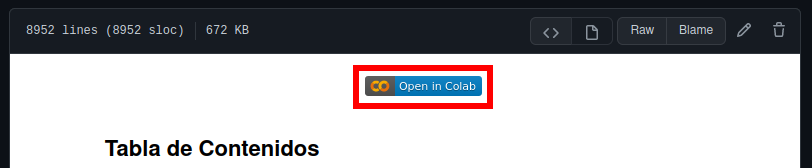

# DigitalHouse-DataScience-tp
En este repositorio se encuentran los trabajos prácticos realizados durante el curso de Data Science dictado por [Digital House](https://www.digitalhouse.com/) en el período nov-abr 20/21  
Para acceder y correr las notebooks se debe abrir el archivo `.ipynb` dentro del repositorio y luego hacer click en `Open in Colab` como se muestra en la siguiente imagen:  
  
  
  
Una vez en Colab, seguir las instrucciones dentro de la notebook.
